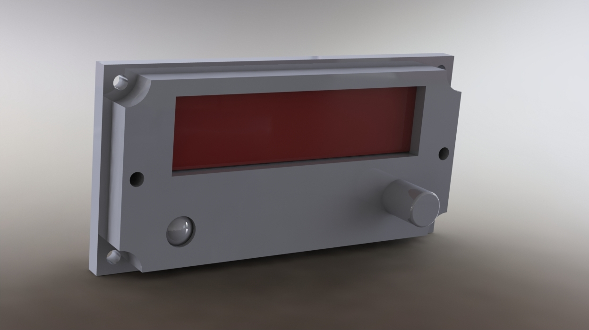
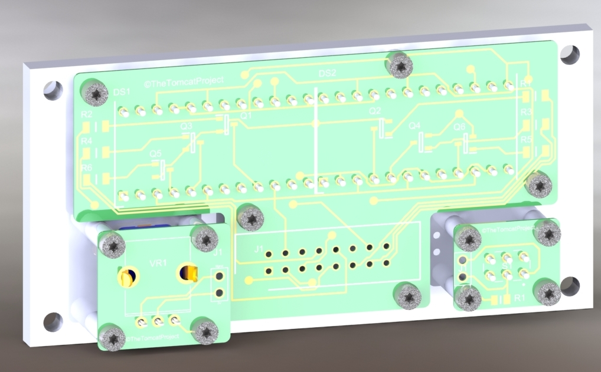

# Buid Instructions

## Components

All product references are RS references.

## To build, you need :

- The 3 printed PCBs

- 1x Push Button (734-6763) for test mode : [Product Page Link](https://fr.rs-online.com/web/p/boutons-poussoirs/7346763)
- 1x Rotary potentiometer (729-3640) for brightness : [Product Page Link](https://fr.rs-online.com/web/p/potentiometres/7293640/)
- 2x LED Display 3 digits (877-0833) for frequency : [Product Page Link](https://fr.rs-online.com/web/p/afficheurs-led/8770833/)

- 6x 150 Ohms Resistor (223-2142) : [Product Page Link](https://fr.rs-online.com/web/p/resistances-a-montage-en-surface/2232142/)
- 1x 10k Ohms Resistor (125-1189) : [Product Page Link](https://fr.rs-online.com/web/p/resistances-a-montage-en-surface/1251189/)
- 6x PNP Transitor (484-5100) : [Product Page Link](https://fr.rs-online.com/web/p/transistors-bipolaires/4845100/)
- 2x 2 Pins Headers (251-8086) : [Product Page Link](https://fr.rs-online.com/web/p/embases-circuits-imprimes/2518086)
- 1x 16 Pins connector (625-7268) : [Product Page Link](https://fr.rs-online.com/web/p/embases-circuits-imprimes/6257268)

Just follow the schematics in the BOARDS/x folder. Don't forget to connect GND if needed with the screw.
